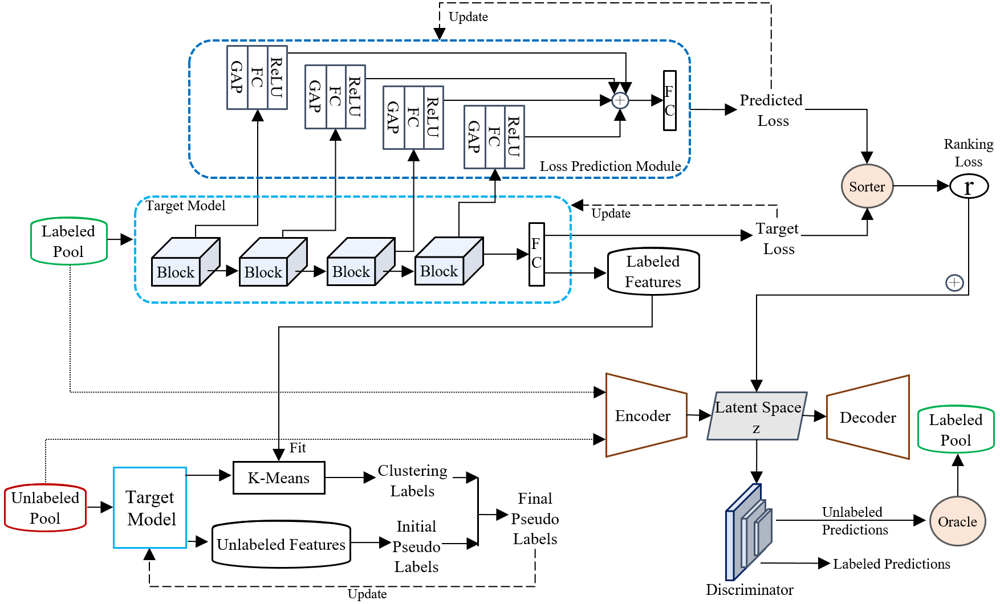

## Semi-Supervised Variational Adversarial Active Learning via Learning to Rank and Agreement-Based Pseudo Labeling

### Overview

Active learning aims to alleviate the amount of labor involved in data labeling
by automating the selection of unlabeled samples via an acquisition function.
For example, variational adversarial active learning (VAAL) leverages an
adversarial network to discriminate unlabeled samples from labeled ones using
latent space information. However, VAAL has the following shortcomings: (i) it
does not exploit target task information, and (ii) unlabeled data is only used
for sample selection rather than model training. To address these limitations,
we introduce novel techniques that significantly improve the use of abundant
unlabeled data during training and take into account the task information.

This repository provides source code for our 2024 ICPR paper titled
"[Semi-Supervised Variational Adversarial Active Learning via Learning to Rank
and Agreement-Based Pseudo Labeling](https://arxiv.org/pdf/2408.12774)."
Concretely, we propose an improved pseudo-labeling algorithm that leverages
information from all unlabeled data in a semi-supervised manner, thus allowing
a model to explore a richer data space. In addition, we develop a
ranking-based loss prediction module that converts predicted relative ranking
information into a differentiable ranking loss. This loss can be embedded as a
rank variable into the latent space of a variational autoencoder and then
trained with a discriminator in an adversarial fashion for sample selection. We
demonstrate the superior performance of our approach over the state of the art
on various image classification and segmentation benchmark datasets.

### Citation

If you find this project useful, then please consider citing our work.

```
@inproceedings{lyu2024semi,
  title={Semi-Supervised Variational Adversarial Active Learning via Learning to Rank and Agreement-Based Pseudo Labeling},
  author={Lyu, Zongyao and Beksi, William J},
  booktitle={Proceedings of the International Conference on Pattern Recognition (ICPR)},
  pages={},
  year={2024}
}
```

### Architecture Outline 

<p align="center">

</p>

### Installation

#### Prerequisites

Run the following command to install the required packages.

```shell
  pip install -r requirements.txt 
```

### Usage

We utilize the SoDeep software to provide a ranking algorithm as the sorter in
our framework. This sorter is trained separately from the rest of the model. To
train the sorter, you can go to the [SoDeep
repository](https://github.com/technicolor-research/sodeep) and follow the
instructions. In this work, we use the LSTM sorter with a length of 128. After
training is complete, the sorter is applied to the loss prediction module to
convert the predicted and target losses into ranking losses for the active
learning process. (Note: You can train a sorter with any length, but the length
of the sorter must be consistent with the batch size.)

Run the following script to train the active learning model.

```shell
  python main_sodeep_semi.py --dataset cifar10 --data_path path/to/your/data --batch_size 128 --no_of_epochs 150 --trials 1 --cycles 10 --weight_path path/to/your/sorter

```

### License 

[](https://github.com/robotic-vision-lab/Semi-Supervised-Variational-Adversarial-Active-Learning/blob/main/LICENSE)
